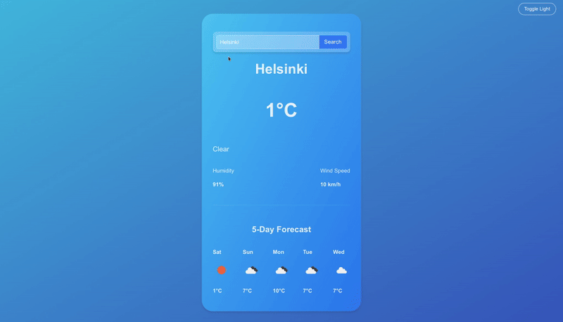

# 🌤️ Weather App

A minimalistic weather forecast app built with **React + Vite**.  
This project was created for learning purposes — to practice working with **APIs**, **React hooks**, and writing clean, readable code using **ESLint** and **Prettier**.

---

## ✨ Features

- 🔍 Search weather by city name
- 🌡️ Display current temperature, humidity, and wind speed
- 📅 5-day forecast with weather icons
- ⚠️ Error handling and loading states
- 📲 Simple and modern UI built with pure CSS

---

## 🚀 Future Improvements

- [ ] 🔄 Celsius ↔ Fahrenheit toggle
- [ ] 📍 Detect location via Geolocation API
- [ ] 🧭 Responsive design
- [ ] 🌀 Custom loading animation

---

## 🧩 Technologies Used

- **React (Vite)**
- **JavaScript (ES6+)**
- **OpenWeather API**
- **Prettier + ESLint**

---

## 📸 Screenshots & Demo

**Live demo GIF:**  


## ⚙️ Getting Started

### 1. Clone the repo

```bash
git clone https://github.com/yourusername/weather-app.git
cd weather-app
```

### 2. Install dependencies

```bash
npm install
```

### 3. Create .env file

VITE_WEATHER_API_KEY=your_api_key_here

### 4. Run the app

```bash
npm run dev
```

Then open:
👉 http://localhost:5173/

## 🧠 What I Learned

How to fetch and display data from a public API
How to manage state with React hooks (useState, useEffect)
How to structure a simple React project using Vite
How to maintain clean code formatting with ESLint and Prettier

## 🧑‍💻 Author

Created by Dmitry Nazarov
Student at TAMK – Business Information Systems
