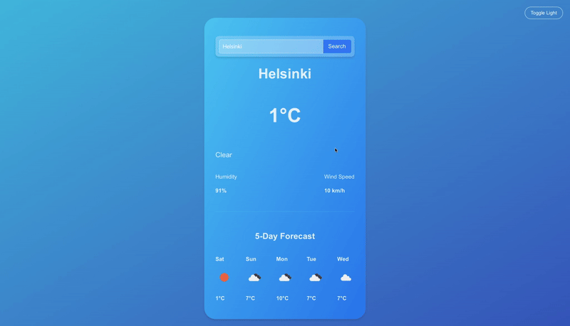

# 🌤️ Weather App

A minimalistic and dynamic weather forecast app built with **React + Vite**.  
This project was created for learning purposes — to practice working with **APIs**, **React hooks**, and building interactive UI with clean, maintainable code using **ESLint** and **Prettier**.

---

## ✨ Features

- 🔍 Search weather by city name
- 🌡️ Display current temperature, humidity, and wind speed
- 📅 5-day forecast with weather icons
- 🌈 Dynamic wrapper background that changes color based on temperature and conditions
- 🌓 Dark & light theme toggle
- ⚠️ Error handling and loading states
- 📲 Simple and modern UI built with pure CSS

---

## 🚀 Future Improvements

- [ ] 🎞️ Animated backgrounds (rain, sun rays, snow, etc.)
- [ ] 🔄 Celsius ↔ Fahrenheit toggle
- [ ] 📍 Detect user location via Geolocation API
- [ ] 🧭 Fully responsive design
- [ ] 🌀 Custom loading animation

---

## 🧩 Technologies Used

- **React (Vite)**
- **JavaScript (ES6+)**
- **OpenWeather API**
- **Prettier + ESLint**

---

## 🧠 Key Functions

### `getWrapperGradient(tempC, condition)`

Dynamically sets the background gradient of the weather card based on temperature and condition:

- ☀️ Clear weather — blue or yellow tones depending on temperature
- 🌧️ Rain — dark blue tones
- 🌨️ Snow — light, cold gradient
- ☁️ Cloudy — neutral gray/blue tone
- 🌡️ Fallback gradients based on temperature if condition is missing

### `toggleDark()`

Toggles between **dark** and **light** mode by updating the body background gradient.

---

## 📸 Screenshots & Demo

**Live demo GIF:**  


---

**Switching between dark and light theme GIF:**  


---

## ⚙️ Getting Started

### 1. Clone the repo

```bash
git clone https://github.com/yourusername/weather-app.git
cd weather-app
```

### 2. Install dependencies

```bash
npm install
```

### 3. Create .env file

VITE_WEATHER_API_KEY=your_api_key_here

### 4. Run the app

```bash
npm run dev
```

Then open:
👉 http://localhost:5173/

## 🧠 What I Learned

How to fetch and display data from a public API
How to manage state with React hooks (useState, useEffect)
How to structure a simple React project using Vite
How to maintain clean code formatting with ESLint and Prettier

## 🧑‍💻 Author

Created by Dmitry Nazarov
Student at TAMK – Business Information Systems
